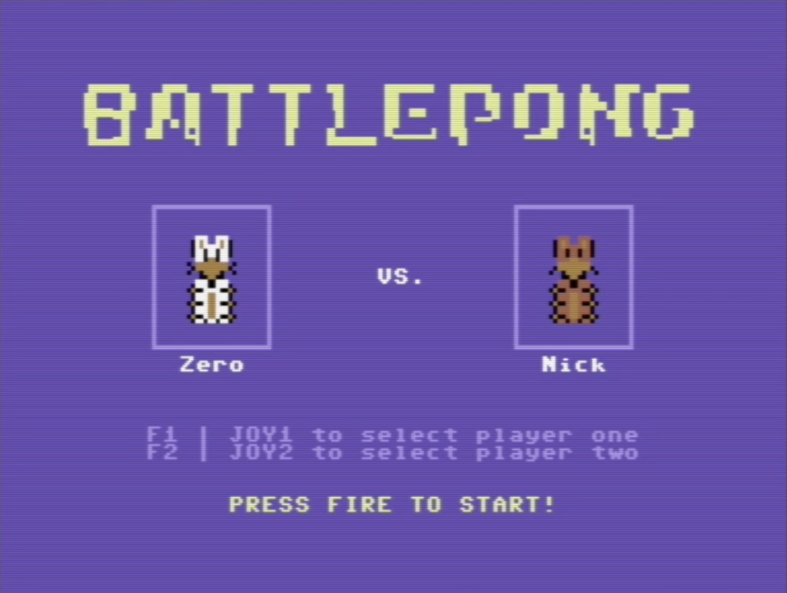
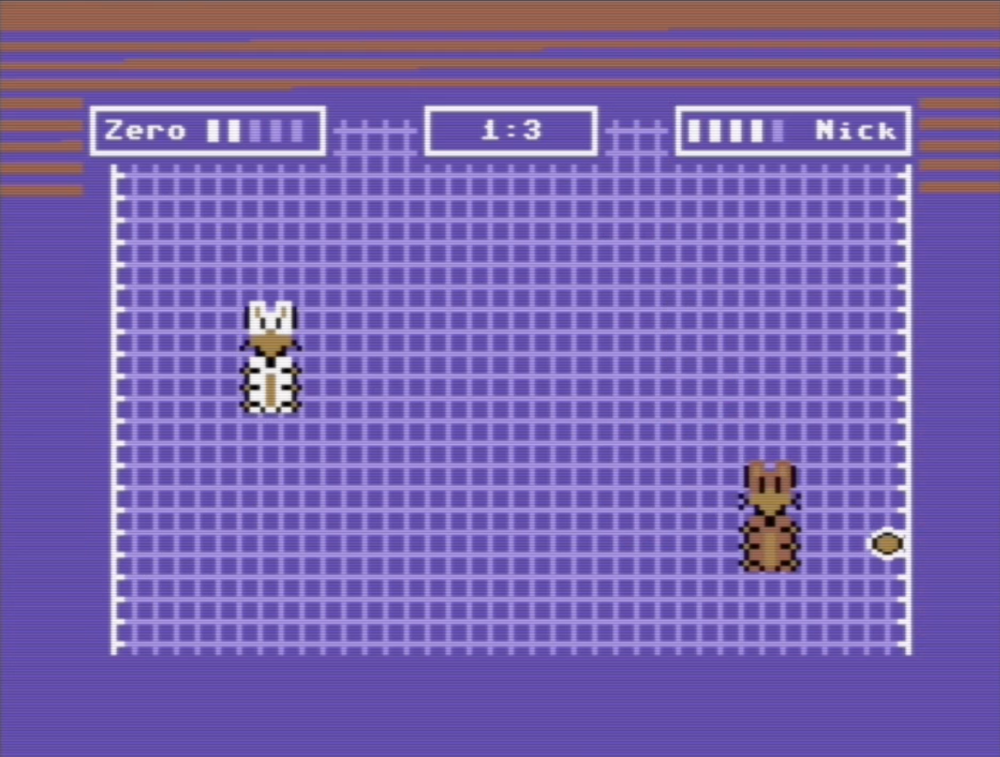
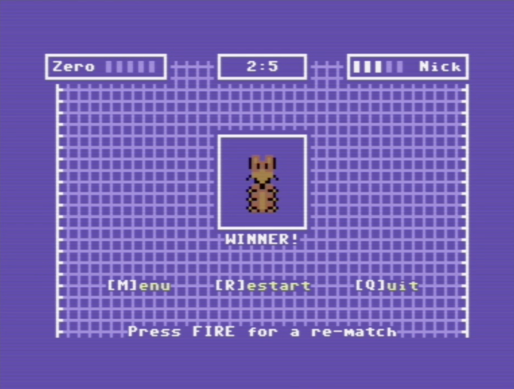

This isn't my original code, but I did compile the file using make on Nix.
Compiling C for the C64 is always fun.

I am thinking about making changes to the sprites.

Using Vice to run the prg for the Commodore 64.

Original repo.
https://github.com/vulcanlogic/battlepong

